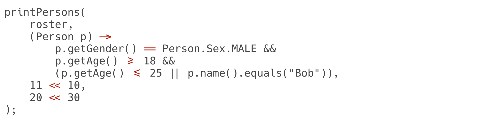
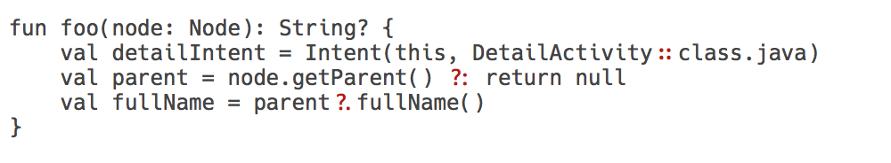
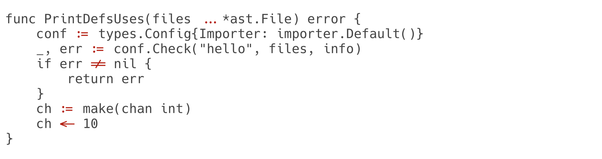
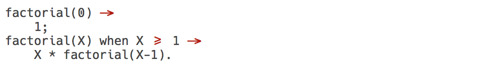
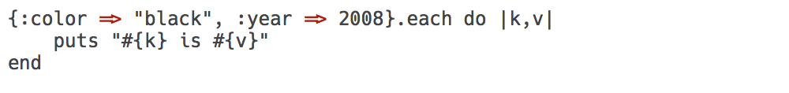

# Hæck

Hæck is the [Hack](http://sourcefoundry.org/hack/) fork with programming ligatures.

[Download v0.1](https://github.com/ignatov/Haack/releases/download/0.1/Haeck-Regular.ttf).

### Code examples

#### Java

#### Kotlin

### Go

#### Erlang

#### Ruby

